# 消息队列

## 基础概念

- 消息队列的定义：消息队列是一种按照一定规则存储和转发消息的中间件，它将消息发送方和接收方解耦，实现异步通信和削峰填谷等功能。
- 消息队列的使用场景：消息队列可以应用于很多场景，例如异步通信、解耦服务、削峰填谷、实现事务、实现分布式锁等。
- 消息队列的基本特性：消息队列具有多种基本特性，例如可靠性、异步性、顺序性、持久性、实时性等。
- 消息队列的应用模式：消息队列的应用模式包括点对点模式和发布订阅模式，它们分别适用于不同的场景。
- 消息队列的产品选型：市面上有很多消息队列产品可供选择，例如 RabbitMQ、Kafka、ActiveMQ、RocketMQ 等，选择合适的产品需要考虑多个因素，例如可靠性、性能、易用性等。

## RocketMQ

### 入门基础

##### 安装

###### Windows

启动

~~~bash
# 启动nameServer服务
start D:\jobsoft\cloud\rocketmq\bin\mqnamesrv.cmd

# 启动broker服务
start D:\jobsoft\cloud\rocketmq\bin\mqbroker.cmd -n 127.0.0.1:9876 autoCreateTopicEnable=true
~~~

###### Linux

### 基础概念

#### 基础概念

##### 特点

- 是一个队列模型的消息中间件，**具有高性能、高可靠、高实时、分布式**等特点
- Producer、Consumer、队列都可以分布式
- Producer 向一些队列轮流发送消息，队列集合称为 Topic，Consumer 如果做广播消费，则一个 Consumer 实例消费这个 Topic 对应的所有队列，**如果做集群消费，则多个 Consumer 实例平均消费这个 Topic 对应的队列集合**
- 能够保证严格的消息顺序
- **支持拉（pull）和推（push）两种消息模式**
- 高效的订阅者水平扩展能力
- 实时的消息订阅机制
- 亿级消息堆积能力
- 支持多种消息协议，如 JMS、OpenMessaging 等
- 较少的依赖

##### 组成模块

- Name Server：Name Server 是 RocketMQ 的命名服务，它充当着路由控制器的角色。它维护了 Broker 的路由信息，可以根据 Topic 和 Consumer Group 查找到对应的 Broker 地址。
- Broker：Broker 是 RocketMQ 的消息存储和分发节点。它接收来自 Producer 发送的消息，存储消息到磁盘，并将消息分发给 Consumer。
- Producer：Producer 是 RocketMQ 的消息生产者，它负责将消息发送到 Broker。Producer 可以指定发送消息的 Topic、消息内容和消息属性等信息。
- Consumer：Consumer 是 RocketMQ 的消息消费者，它订阅 Broker 中指定 Topic 的消息，并按照指定的消费模式（如集群模式或广播模式）消费消息。
- Message：Message 是 RocketMQ 的消息体，包括 Topic、Tag、消息内容和消息属性等信息。
- Topic：Topic 是 RocketMQ 的消息主题，它是 Producer 和 Consumer 之间消息传递的逻辑概念，每个 Topic 对应着多个消息。
- Tag：Tag 是 Topic 的子分类，它可以用来区分同一 Topic 下的不同类型消息。
- Consumer Group：Consumer Group 是一组 Consumer 的集合，它们共同消费同一个 Topic 下的消息。RocketMQ 支持集群消费和广播消费两种消费模式。

##### rocketMQ模型

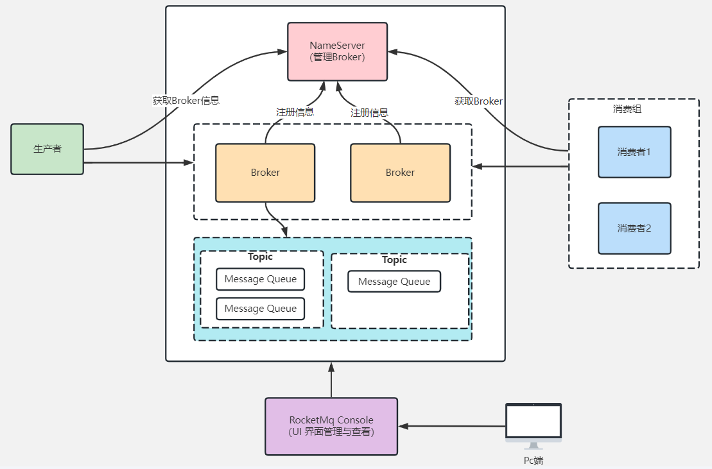

1. NameServer：提供轻量级的服务发现和路由
   每个 NameServer 记录完整的路由信息  提供等效的读写服务  并支持快速存储扩展
2. Broker：通过提供轻量级的 Topic 和 Queue 机制来处理消息存储
   同时支持推（push）和拉（pull）模式以及主从结构的容错机制
3. Producer：生产者 产生消息的实例
   拥有相同 Producer Group 的 Producer 组成一个集群
4. Consumer：消费者 接收消息进行消费的实例
   拥有相同 Consumer Group 的Consumer 组成一个集群

##### 集群模型

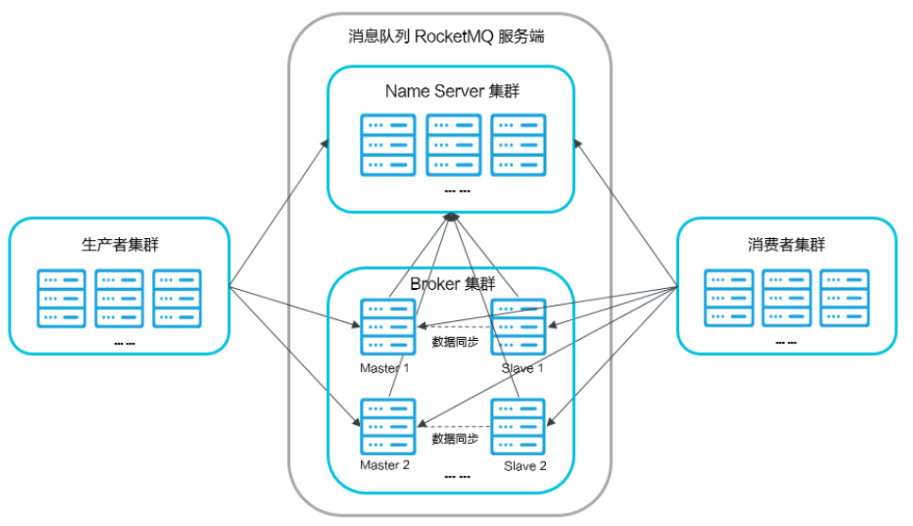

##### Topic Broker Queue

三者之间的关系

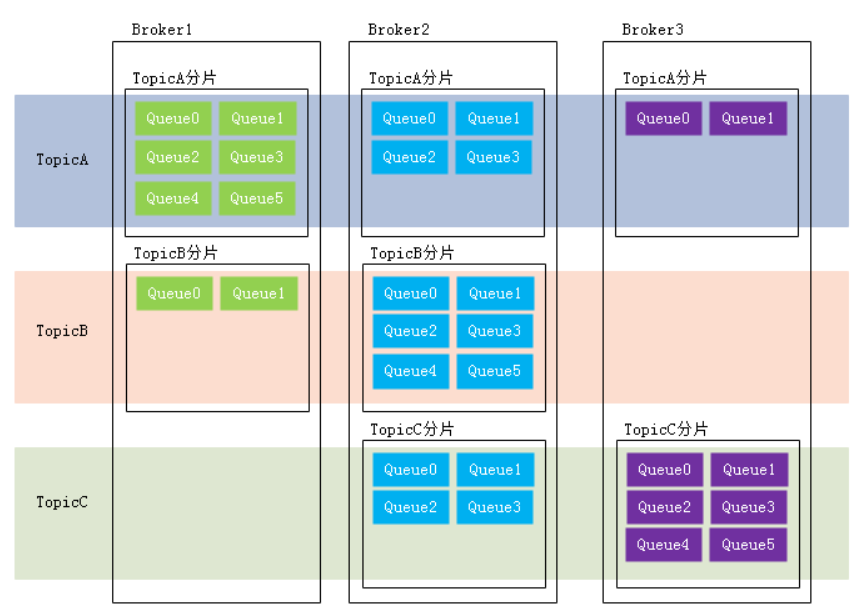

##### 发布订阅流程

1. producer生产者连接nameserver  产生数据放入不同的topic
2. 在RocketMQ中Topic可以分布在各个Broker上
   Topic分布在一个Broker上的子集 可以成为Topic分片
3. 将Topic分片再切分为若干等分  其中的一份就是一个Queue
   每个Topic分片等分的Queue的数量可以不同 由用户在创建Topic时指定
4. consumer消费者连接nameserver  根据broker分配的Queue来消费数据

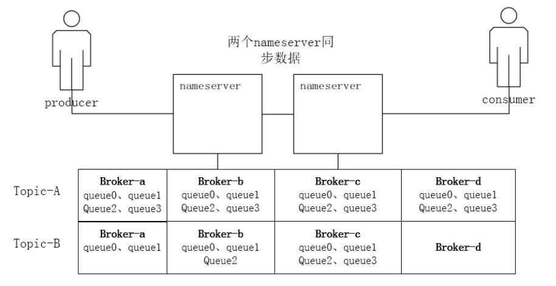

#### 集群概念

##### 心跳机制

- broker每30s向NameServer发送一次心跳
  - 源码中，心跳即重新发送了一次注册
  - nameserver内部维护了一个ConcurrentHashMap储存注册的broker
- nameserver每10s中检查一次心跳
- 120s未接到心跳，则认为该broker 宕机了

##### 数据同步

- Producer向nameserver拉取broker信息 不是推送
- 主从同步 : slave从master拉取数据
- consumer从broker拉取数据消费

##### 高可用 - 故障切换

- master挂掉需要运维工程师手动调整配置 把slave切换成master 不支持自动主备切换
- **version 4.5之后引入了Dledger 实现了高可用自动切换**

### 消息种类

#### 按照发送分类

- 同步消息：发送方发出数据后  **会阻塞直到MQ服务方发回响应消息**
  应用场景：例如重要通知邮件、报名短信通知、营销短信系统等（）
- 异步消息：发送方发出数据后  **不等接收方发回响应**  (异步消息需要实现回调方法 通过回调方法接受响应)
  应用场景：例如用户视频上传后通知启动转码服务  转码完成后通知推送转码结果等
- 单向消息：只负责发送消息  不等待服务器回应且没有回调函数触发
  应用场景：适用于某些耗时非常短  但对可靠性要求并不高的场景  例如日志收集

#### 按照功能分类

- 普通消息
- 顺序消息
- 广播消息
- 延时消息
- 批量消息
- 事务消息

### 发布订阅

#### 消息发布

Java中所有的发布方法

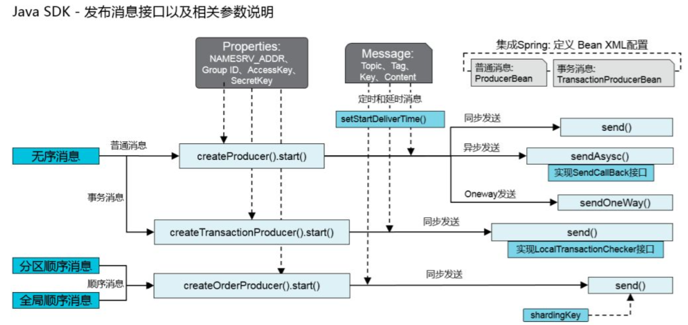

#### 消息订阅

消息订阅分为 push和pull 两种模式

- Push模式：即MQServer主动向消费端推送
- Pull模式：即消费端在需要时  主动到MQServer拉取

但是本质上rocketMQ中都是Pull模式 (Push模式是通过长轮询实现的)

#### 消费模式

- 集群消费：集群消费模式下 rocketMQ认为消息只要被集群内的一个消费者消费即可
  每条消息只被处理一次

  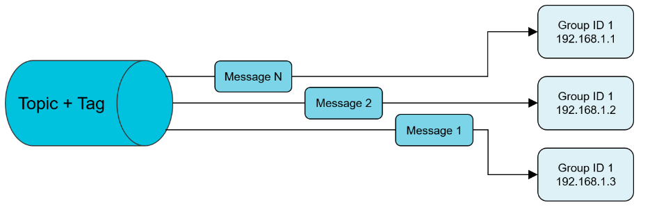

- 广播消费：广播消费模式下 队列中的每条消息都会推送给所有注册过的消费者
  每条消息都需要被相同逻辑的多台机器处理
  广播消费模式下不支持顺序消息

  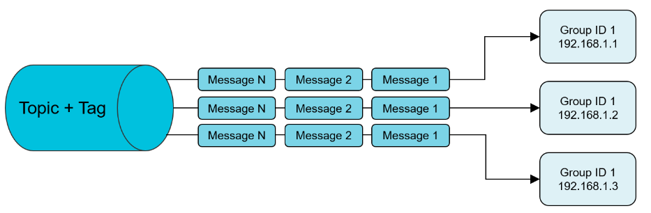

可以用集群模式模拟广播模式

### SpringBoot整合

#### 基础案例

##### 生产者

~~~java
@Service
public class ProducerService {
    private DefaultMQProducer producer = null;
    // 生产者初始化
    @PostConstruct
    public void initMQProducer() throws MQClientException {
        producer = new DefaultMQProducer("defaultGroup");// 设置生产组名称
        producer.setNamesrvAddr("localhost:9876");// 设置nameserver地址
        producer.setRetryTimesWhenSendFailed(3);
        producer.start();// 开启资源
    }
    // 发送消息
    public boolean send(String topic, String tags, String content) {
        Message msg = new Message(topic, tags, "", content.getBytes());
        try {
            producer.send(msg);
            return true;
        } catch (Exception e) {
            e.printStackTrace();
        }
        return false;
    }

    // 销毁前关闭资源
    @PreDestroy
    public void shutDownProducer() {
        if(producer != null) {
            producer.shutdown();
        }
    }
}
~~~

##### 消费者

~~~java
@Service
public class ConsumerService {
    private DefaultMQPushConsumer consumer = null;
    // 初始化消费者
    @PostConstruct
    public void initMQConsumer() {
        consumer = new DefaultMQPushConsumer("defaultGroup");// 设置消费组名称
        consumer.setNamesrvAddr("localhost:9876");// 设置nameserver地址
        try {
            consumer.subscribe("TEST-0717-TOPIC", "TAG_0717");// 设置topic 和 tag过滤
            consumer.setMaxReconsumeTimes(20);// 设置最大重试次数
            // 设置监听方法
            consumer.registerMessageListener((MessageListenerConcurrently) (msgs, context) -> {
                for (MessageExt msg : msgs) {
                    System.out.println("TAG:TAG_0717 => Message Received: " + new String(msg.getBody()));
                }
                return ConsumeConcurrentlyStatus.CONSUME_SUCCESS;
                // 消费逻辑失败 稍后重试
                //return ConsumeConcurrentlyStatus.RECONSUME_LATER;
            });
            consumer.start();
        } catch (MQClientException e) {
            e.printStackTrace();
        }
    }
    // 关闭资源
    @PreDestroy
    public void shutDownConsumer() {
        if (consumer != null) {
            consumer.shutdown();
        }
    }
}
~~~

#### RocketMQTemplate 整合

##### 配置文件

~~~yaml
rocketmq:
  name-server: 127.0.0.1:9876
  producer:
    group: producer-test-group
    retry-times-when-send-failed: 5 # 消息发送失败重试次数,默认为2
    retry-times-when-send-async-failed: 5 # 异步消息发送失败重试次数,默认为2
  consumer:
    group: consumer-test-group
~~~

##### 生产者

###### 消息体

~~~java
@Data
@Builder
@NoArgsConstructor
@EqualsAndHashCode
@AllArgsConstructor
public class MessageBody {
    // 消息id
    private String messageId;
    // body组装时间
    @Builder.Default
    private long timestamp = System.currentTimeMillis();
    // 来源 附加信息
    private String msgSource;
    // 数据
    private Object data;
}
~~~

###### 同步消息

~~~java
@Autowired
private RocketMQTemplate rocketMQTemplate;
private String TOPIC = "my-topic";
//同步消息     
@GetMapping("/syncSend/{message}")
public String syncSend(@PathVariable("message") String message) {
    MessageBody msg = MessageBody.builder()
            .messageId(IdUtil.simpleUUID())
            .msgSource(message)
            .build();
    SendResult sendResult = rocketMQTemplate.syncSend("my-topic", msg);
    return "Message sent successfully!";
}
~~~

###### 异步消息

~~~java
@Autowired
private RocketMQTemplate rocketMQTemplate;
private String TOPIC = "my-topic";
// 异步消息     
@GetMapping("/asyncSend/{message}")
public String asyncSend(@PathVariable("message") String message) {
    MessageBody msg = MessageBody.builder()
            .messageId(IdUtil.simpleUUID())
            .msgSource(message)
            .build();
    rocketMQTemplate.asyncSend(TOPIC, msg, new SendCallback() {
        @Override
        public void onSuccess(SendResult sendResult) {
            //    成功处理
        }
        @Override
        public void onException(Throwable throwable) {
            //    异常处理
        }
    });
    return "Message sent successfully!";
}
~~~

###### 单向消息

~~~java
@Autowired
private RocketMQTemplate rocketMQTemplate;
private String TOPIC = "my-topic";
//单向消息
@GetMapping("/sendOneWay/{message}")
public String sendOneWay(@PathVariable("message") String message) {
    MessageBody msg = MessageBody.builder()
            .messageId(IdUtil.simpleUUID())
            .msgSource(message)
            .build();
    rocketMQTemplate.sendOneWay(TOPIC, msg);
    return "Message sent successfully!";
}
~~~

###### 顺序消息

顺序消息的关键是参数key - 参数key决定了消息发向那个队列
rocketmq中消息的无序性 就是因为消息发向了不同的队列

切需要在消费端设置为有序消费

~~~java
@Autowired
private RocketMQTemplate rocketMQTemplate;
private String TOPIC = "my-topic";
//顺序消息
@GetMapping("/syncSendOrderly")
public String syncSendOrderly() {
    String allKey = "all";// 使用allKey保证全局顺序 都使用一个消息队列
    for (int i = 0; i < 10; i++) {
        String key = String.valueOf(i);// 使用key保证单个顺序
        MessageBody msg1 = MessageBody.builder()
                .messageId(IdUtil.simpleUUID())
                .msgSource("订单  key：" + key)
                .build();
        rocketMQTemplate.syncSendOrderly(TOPIC + ":MessageBody", msg1, allKey);

        MessageBody msg2 = MessageBody.builder()
                .messageId(IdUtil.simpleUUID())
                .msgSource("发货  key：" + key)
                .build();
        rocketMQTemplate.syncSendOrderly(TOPIC + ":MessageBody", msg2, allKey);
    }
    return "Message sent successfully!";
}
~~~

###### 延时消息

~~~java
@Autowired
private RocketMQTemplate rocketMQTemplate;
private String TOPIC = "my-topic";
//延时消息
@GetMapping("/syncSendDelay")
public String syncSendDelay() {
    Message<MessageBody> meg = MessageBuilder.withPayload(
            MessageBody.builder()
                    .messageId(IdUtil.simpleUUID())
                    .msgSource("---延时消息测试---")
                    .build()
    ).build();
    // 开源版本只支持固定的时间 这里level-3 对应的是10s
    rocketMQTemplate.syncSend(TOPIC, meg, 5000, 3);
    SimpleDateFormat dateFormat = new SimpleDateFormat("yyyy-MM-dd HH:mm:ss");
    log.info(dateFormat.format(new Date()));

    // 下面的写法应该是只针对付费版的 开源版调用 没有延时效果
    //rocketMQTemplate.syncSendDelayTimeSeconds(TOPIC, msg, 20);
    return "Message sent successfully!";
}
~~~

测试结果：实际好像不止10s   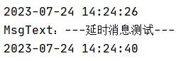

###### 批量消息

~~~java
@Autowired
private RocketMQTemplate rocketMQTemplate;
private String TOPIC = "my-topic";
//批量消息
@GetMapping("/syncBatchSend")
public String syncBatchSend() {
    ArrayList<Message> msgs = new ArrayList<>();
    for (int i = 0; i < 10; i++) {
        Message<MessageBody> msg = MessageBuilder.withPayload(
                MessageBody.builder()
                        .messageId(IdUtil.simpleUUID())
                        .msgSource("---批量消息测试：" + i)
                        .build())
                .build();
        msgs.add(msg);
    }
    rocketMQTemplate.syncSend(TOPIC, msgs);
    return "message batch!";
}
~~~

###### 消息过滤

关于消息过滤 Tag的设置 需要注意 在rocketmq中 一个消费组只能有一个Tag
所以要实现消息过滤 需要在不同的消费组中设置不同的Tag

PS：rocketMQTemplate中Tag的设置是通过topic设置的 格式为：topic:tag
默认tag是* 代表所有 不过滤

~~~java
@Autowired
private RocketMQTemplate rocketMQTemplate;
private String TOPIC = "my-topic";
private String[] TAGS = {"Message_01", "Message_02"};
@GetMapping("/tagSend/{msg}")
public String tagSend(@PathVariable String msg) {
    for (int i = 0; i < 10; i++) {
        String topicTag = TOPIC + ":" + TAGS[i % 2];
        rocketMQTemplate.syncSend(topicTag, msg + i);
    }
    return "message tagSend";
}
~~~

###### 事务消息

RocketMQTemplate中没有实现事务消息 所以下面使用TransactionMQProducer实现事务消息

~~~java
throw new RuntimeException("sendMessageInTransaction not implement, please use TransactionMQProducer class");
~~~

事务消息中最重要的是事务监听器的实现 -> TransactionListener
executeLocalTransaction - > 在发送half消息后调用 执行本地事务  如果本地事务执行成功 RocketMQ再提交消息
checkLocalTransaction - > 用于检查事务是否执行成功 RocketMQ 依赖此方法做补偿

事务消息原理：**通过内部的两个 Topic 来实现对消息的两阶段支持**

- prepare：将消息（消息带有事务标识）投递到一个名为 **RMS_SYS_TRANS_HALF_TOPIC** 的topic中
  而不是投递到真正的 topic 中
- commit rollback：生产者再通过TransactionListener的executeLocalTransaction()执行本地事务
  事务处理成功或失败后  生产者producer会向broker发送commit或者rollback命令
  - 如果是commit会将消息投递到真实的topic中
    然后再投递一个表示删除的消息到RMS_SYS_TRANS_HALF_TOPIC中表示当前事务完成
  - 如果是 rollback 则只需投递表示删除的消息即可

~~~java
@GetMapping("/transactionSend")
public String transactionSend() throws MQClientException {
    //自定义接收RocketMQ回调的监听接口
    TransactionListener transactionListener = new TransactionListener() {
        //如果half消息发送成功了，就会回调这个方法，执行本地事务
        @Override
        public LocalTransactionState executeLocalTransaction(org.apache.rocketmq.common.message.Message message, Object o) {
            // 执行订单本地业务，并根据结构返回commit/rollback
            try {
                // 本地事务执行异常
                //throw new Exception();

                // 本地事务执行成功 返回commit
                // 本地事务逻辑 添加订单 发货之类
                return LocalTransactionState.COMMIT_MESSAGE;
            } catch (Exception e) {
                // 本地事务执行失败，返回rollback,作废half消息
                return LocalTransactionState.ROLLBACK_MESSAGE;
            }
        }

        //如果没有正确返回commit或rollback，会执行此方法
        @Override
        public LocalTransactionState checkLocalTransaction(MessageExt messageExt) {
            // 查询本地事务是否已经成功执行了,再次根据结果返回commit/rollback
            try {
                // 本地事务执行成功，返回commit
                System.out.println("查询本地事务 事务成功 返回成功");
                return LocalTransactionState.COMMIT_MESSAGE;
            } catch (Exception e) {
                System.out.println("查询本地事务 事务失败 返回成功");
                // 本地事务执行失败，返回rollback,作废half消息
                return LocalTransactionState.ROLLBACK_MESSAGE;
            }
        }
    };

    TransactionMQProducer transactionMQProducer = new TransactionMQProducer();
    transactionMQProducer.setNamesrvAddr("127.0.0.1:9876");// nameserver
    transactionMQProducer.setProducerGroup("producer-test-group");// 生产组
    transactionMQProducer.setTransactionListener(transactionListener);// 设置监听
    transactionMQProducer.start();

    // 消息主体
    org.apache.rocketmq.common.message.Message message = new org.apache.rocketmq.common.message.Message();
    message.setTopic(TOPIC);
    message.setTags("String");
    message.setBody("-----测试事务消息----".getBytes());

    // 投递事务消息
    transactionMQProducer.sendMessageInTransaction(message, null);

    transactionMQProducer.shutdown();
    return "message transactionSend";
}
~~~

##### 消费者

~~~java
@Component
@RocketMQMessageListener(
        topic = "my-topic",// topic
        selectorExpression = "MessageBody",// tag
        consumerGroup = "consumer-group-messagebody",// 消费者组
        nameServer = "${rocketmq.name-server}",// nameserver
        maxReconsumeTimes = 20,// 设置重试次数
        messageModel = MessageModel.CLUSTERING,// 设置消息模式 广播模式||集群模式
        consumeMode = ConsumeMode.ORDERLY // 设置消费模型 并发接受||有序接受
)
public class RocketMessageBodyListener implements RocketMQListener<MessageBody> {
    @Override
    public void onMessage(MessageBody messageBody) {
        log.info("MsgText：" + messageBody.getMsgSource());
        SimpleDateFormat dateFormat = new SimpleDateFormat("yyyy-MM-dd HH:mm:ss");
        log.info(dateFormat.format(new Date()));
    }
}
~~~

### SpringCloud整合

#### SpringCloudStream 3.0之前

#### SpringCloudStream 3.0之后

### 集群搭建

#### 高可用 - Dledger

### 高级特性

#### 工作流程

##### 大致流程

1、消息生成者发送消息

2、MQ收到消息，将消息进行持久化，在存储中新增一条记录

3、返回ACK给生产者

4、MQ push 消息给对应的消费者，然后等待消费者返回ACK

5、如果消息消费者在指定时间内成功返回ack，那么MQ认为消息消费成功；如果MQ在指定时间内没有收到ACK，则认为消息消费失败，会尝试重新push消息

##### 详细流程

1. 启动NameServer,NameServer启动后开始监听端口 等待broker、producer、consumer连接

2. 启动broker时 broker会和所有的NameServer建立并保持长链接  然后每隔30s向NameServer定时发送心跳包

3. 发送消息前 可以先创建Topic
   创建Topic时需要指定该topic要存储在哪些broker上 同时也会将topic和broker的关系写入到NameServer
   不过这步并不是必需的 也可以在发送消息时自动创建topic

   手动创建Topic有两种模式：

      1）集群模式：该模式下创建的Topic在该集群中，所有Broker的Queue数量是相同的。

      2）Broker模式：该模式下创建的Topic在该集群中，每个Broker的Queue数量可以不同。

   自动创建Topic时，默认采用Broker模式，会为每个Broker默认创建4个Queue

4. producer发送消息 启动时与NameServer集群中的其中一台建立长链接 并从NameServer中获取路由信息 即Topic和Queue与Broker的地址(IP+Port)的映射关系 
   然后根据算法策略从队列选择一个Queue与队列所在的broker建立长链接从而向broker发送消息 
   在获取到路由信息后 Producer会首先将路由信息缓存到本地 再每隔30s从NameServer更新一个路由信息

5. Consumer和NameServer建立长链接 获取其所订阅的Topic信息 然后根据算法策略从路由信息中获取到所要消费的Queue然后和broker建立长链接 开始消费其中的消息 Consumer在获取到路由信息后 也会每隔30s从NameServer更新一次路由信息 
   不过和Producer不同的是 Consumer还会向Broker发送心跳 以确保Broker的存活状态·

#### 消息存储

##### 存储原理

MQ有三种存储方式：文件存储、DB存储、分布式KV存储
存储效率：文件系统>分布式KV存储>关系型数据库
易用性：关系型数据库>分布式KV存储>文件系统

RocketMQ采用的是磁盘操作的文件存储
RocketMQ的消息用顺序写 保证了消息存储的速度（顺序写的磁盘操作是随机写的6000倍）

##### 存储结构

- CommitLog：该文件主要存储消息主体以及元数据的主体 单个文件大小默认1G
  commitLog文件保存着所有的主题消息
- ConsumeQueue：是为了高效检索主题消息 也可以说是CommitLog文件的索引
  ConsumeQueue存储的不是消息本身 而是消息消费进度
  - 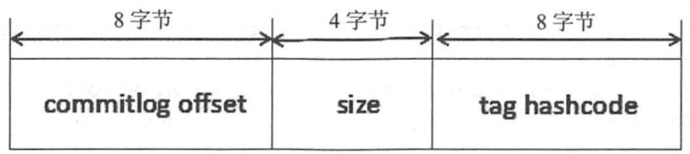
- MessageQueue：一个 Topic 默认对应四个 MessageQueue   MessageQueue跟Broker绑定
  MessageQueue是为了数据分片而设计的（将Topic数据分片到多台Broker上）
- Index：Hash 索引机制 rocketMQ也可以通过hash索引找到消息
  为消息查询提供了一种通过key或时间区间来查询消息的方法
  这种通过IndexFile来查找消息的方法不影响发送与消费消息的主流程

##### 存储逻辑

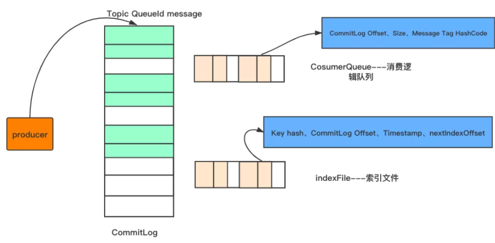

##### 刷盘机制

###### 同步刷盘

直到消息写入磁盘后 才返回成功

###### 异步刷盘

消息发送成功后 就返回成功 到达一定的数据量后一起写入磁盘

#### 高可用机制

RocketMQ分布式集群是通过Master和Slave的配合达到高可用性的
Master角色的Broker支持读和写，Slave角色的Broker仅支持读

Master和Slave的区别：在Broker的配置文件中，参数 brokerId的值为0表明这个Broker是Master，大于0表明这个Broker是 Slave，同时brokerRole参数也会说明这个Broker是Master还是Slave。

##### 消费高可用

在Consumer的配置文件中，并不需要设置是从Master读还是从Slave 读，当Master不可用或者繁忙的时候，Consumer会被自动切换到从Slave 读。有了自动切换Consumer这种机制，当一个Master角色的机器出现故障后，Consumer仍然可以从Slave读取消息，不影响Consumer程序。这就达到了消费端的高可用性。

##### 发送高可用

在创建Topic的时候 把Topic的多个Message Queue创建在多个Broker组上（相同Broker名称 不同 brokerId的机器组成一个Broker组）这样当一个Broker组的Master不可用后  其他组的Master仍然可用 Producer仍然可以发送消息
**RocketMQ目前还不支持把Slave自动转成Master**  如果机器资源不足 需要把Slave转成Master 则要手动停止Slave角色的Broker  更改配置文件  用新的配置文件启动Broker

##### 消息主从复制

###### 同步复制

同步复制方式是等Master和Slave均写 成功后才反馈给客户端写成功状态；
在同步复制方式下，如果Master出故障， Slave上有全部的备份数据，容易恢复，但是同步复制会增大数据写入 延迟，降低系统吞吐量。

###### 异步复制

异步复制方式是只要Master写成功 即可反馈给客户端写成功状态。
在异步复制方式下，系统拥有较低的延迟和较高的吞吐量，但是如果Master出了故障，有些数据因为没有被写 入Slave，有可能会丢失；

###### 配置

同步复制和异步复制是通过Broker配置文件里的brokerRole参数进行设置的，这个参数可以被设置成ASYNC_MASTER、 SYNC_MASTER、SLAVE三个值中的一个。

#### 负载均衡

##### 生产端 负载均衡

Producer端，每个实例在发消息的时候，默认会轮询所有的message queue发送，以达到让消息平均落在不同的queue上。而由于queue可以散落在不同的broker，所以消息就发送到不同的broker下

##### 消费端 负载均衡

###### 集群模式

每条消息只需要投递到订阅这个topic的Consumer Group下的一个实例即可
集群模式下，queue都是只允许分配只一个消费者实例，这是由于如果多个实例同时消费一个queue的消息，由于拉取哪些消息是consumer主动控制的，那样会导致同一个消息在不同的实例下被消费多次，所以算法上都是一个queue只分给一个consumer实例，一个consumer实例可以允许同时分到不同的queue。

###### 广播模式

由于广播模式下要求一条消息需要投递到一个消费组下面所有的消费者实例，所以也就没有消息被分摊消费的说法。
在实现上，其中一个不同就是在consumer分配queue的时候，所有consumer都分到所有的queue。

#### 消息重试

rocketMQ在Consumer启动时可以自定义重试次数 
最大重试次数小于等于 16 次，则重试时间间隔同下表描述
最大重试次数大于 16 次，超过 16 次的重试时间间隔均为每次 2 小时
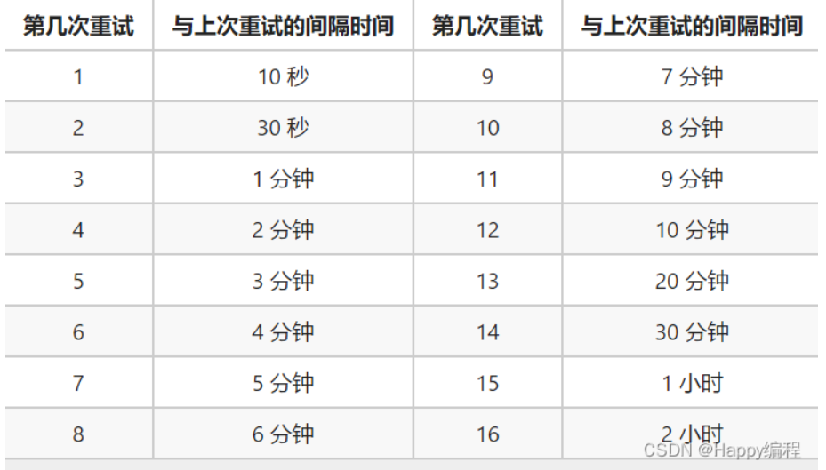

##### 顺序消息重试

对于顺序消息，当消费者消费消息失败后，消息队列 RocketMQ 会自动不断进行消息重试（每次间隔时间为 1 秒），这时，应用会出现消息消费被阻塞的情况。因此，在使用顺序消息时，务必保证应用能够及时监控并处理消费失败的情况，避免阻塞现象的发生。

##### 无序消息重试

对于无序消息（普通、定时、延时、事务消息）当消费者消费消息失败时，您可以通过设置返回状态达到消息重试的结果。无序消息的重试只针对集群消费方式生效；广播方式不提供失败重试特性，即消费失败后，失败消息不再重试，继续消费新的消息。
消息队列 RocketMQ 默认允许每条消息最多重试16次  如果消息重试16次后仍然失败 消息将不再投递

##### 配置方法

集群消费方式下，消息消费失败后期望消息重试，需要在消息监听器接口的实现中明确进行配置

###### DefaultMQPushConsumer

~~~java
DefaultMQPushConsumer consumer = new DefaultMQPushConsumer("TAG_0721_Group");
consumer.setMaxReconsumeTimes(20);// 设置最大重试次数
~~~

###### RocketMQListener

~~~java
@RocketMQMessageListener(
        topic = "my-topic",
        selectorType = SelectorType.TAG,
        selectorExpression = "Message_01",
        consumerGroup = "consumer-group-message_01",
        nameServer = "${rocketmq.name-server}",
        maxReconsumeTimes = 20,// 设置重试次数
        messageModel = MessageModel.CLUSTERING,// 设置消息模式 广播模式||集群模式
        consumeMode = ConsumeMode.ORDERLY // 设置消费模型 并发接受||有序接受
)
~~~

#### 死信队列

##### 概念

死信消息：正常情况下无法被消费的消息

死信队列：储存死信消息的队列 消息重试超过一定次数后（默认16次）就会被放到死信队列中

可以在控制台Topic列表中看到“DLQ”相关的Topic，默认命名是：

- %RETRY%消费组名称（重试Topic）
- %DLQ%消费组名称（死信Topic）

##### 特征

1. 死信队列中的消息 不会再被消费者正常消费
2. 有效期与正常消息相同均为3天 3天后会被自动删除 
   因此 请在死信消息产生后的3天内及时处理

#### 消息幂等

##### 问题

消息发送时重复：实际消息已经在服务器端完成了持久化 但ACK返回失败
生产者会再次重试发送 且两条消息内容相同并且 Message ID 也相同

消息消费时重复：实际消息已经消费完成 但ACK返回失败
rocketmq为确保每条消息都被消费一次 会重试

##### 方案

rocketmq中的MessageID可能重复 所以最好的幂等处理是以业务唯一标识来处理

### 面试整理

- RocketMQ Broker中的消息被消费后会立即删除吗？
  不会 每条消息都会持久化到CommitLog中 每个Consumer连接到Broker后会维持消费进度信息
  当有消息消费后 只是当前Consumer的消费进度（CommitLog的offset）更新了 不会删除
  清理机制是默认72小时后会删除不再使用的CommitLog文件
- RocketMQ消费模式有几种？
  集群消费：一条消息只会被同Group中的一个Consumer消费 多个Group可以多次消费
  广播消费：Group中所有订阅的Consumer实例都消费一遍
- 消费消息是push还是pull？
  RocketMQ没有真正意义的push 都是pull
  虽然有push类 但实际底层实现采用的是长轮询机制 即拉取方式
- 为什么要主动拉取消息而不使用事件监听方式？
  如果broker主动推送消息的话有可能push速度快 消费速度慢的情况 那么就会造成消息在consumer端堆积过多 同时又不能被其他consumer消费的情况
  而pull的方式可以根据当前自身情况来pull 不会造成过多的压力而造成瓶颈 所以采取了pull的方式
- broker如何处理拉取请求的？
  Consumer首次请求Broker Broker中是否有符合条件的消息
  - 有 ->响应Consumer 等待下次Consumer的请求
  - 没有 ->PullRequestHoldService来Hold连接 每个5s执行一次检查pullRequestTable有没有消息 有的话立即推送
    每隔1ms检查commitLog中是否有新消息 有的话写入到pullRequestTable 当有新消息的时候返回请求
    挂起consumer的请求 即不断开连接也不返回数据使用consumer的offset
- RocketMQ如何做负载均衡？
  - producer发送消息的负载均衡：默认会轮询向Topic的所有queue发送消息 以达到消息平均落到不同的queue上
    而由于queue可以落在不同的broker上 就可以发到不同broker上（当然也可以指定发送到某个特定的queue上）
  - consumer订阅消息的负载均衡：假设有5个队列 两个消费者 则第一个消费者消费3个队列 第二个则消费2个队列 以达到平均消费的效果
    而需要注意的是 当consumer的数量大于队列的数量的话 根据rocketMq的机制 多出来的Consumer不会去消费数据
    因此建议consumer的数量小于或者等于queue的数量避免不必要的浪费
- 消息重复消费？
  影响消息正常发送和消费的重要原因是网络的不确定性
  - 原因
    - ACK问题：正常情况下在consumer真正消费完消息后应该发送ack，通知broker该消息已正常消费，从queue中剔除
      当ack因为网络原因无法发送到broker，broker会认为此条消息没有被消费，此后会开启消息重投机制把消息再次投递到consumer
    - 消费模式：在CLUSTERING模式下，消息在broker中会保证相同group的consumer消费一次，但是针对不同group的consumer会推送多次
  - 解决方法：
    - 去重操作直接放在了消费端 消费端处理消息的业务逻辑保持幂等性
    - 数据库表记录消息主键
- 如何让RocketMQ保证消息的顺序消费？
  多个queue只能保证单个queue里的顺序
- 怎么保证消息发到同一个queue？
  如果是rocketMQTemplate的话直接设置key就行
  如果是原生的api的话 就要自己实现选择算法
- RocketMQ如何保证消息不丢失？
  - Producer端如何保证消息不丢失
    采取send()同步发消息 发送结果是同步感知的 发送失败后可以重试 设置重试次数 默认3次
    producer.setRetryTimesWhenSendFailed(10);
    集群部署 比如发送失败了的原因可能是当前Broker宕机了 重试的时候会发送到其他Broker上
  - Broker端如何保证消息不丢失
    修改刷盘策略为同步刷盘 默认情况下是异步刷盘的
    flushDiskType = SYNC_FLUSH
    集群部署 主从模式 高可用
  - Consumer端如何保证消息不丢失
    完全消费正常后在进行手动ack确认
- 堆积时间过长消息超时了？
  RocketMQ中的消息只会在commitLog被删除的时候才会消失 不会超时 也就是说未被消费的消息不会存在超时删除这情况
- 堆积的消息会不会进死信队列？
  不会 消息在消费失败后会进入重试队列（%RETRY%+ConsumerGroup）16次 才会进入死信队列（%DLQ%+ConsumerGroup）
- RocketMQ在分布式事务支持这块机制的底层原理?
  Half Message：预处理消息 当broker收到半消息后 会存储到RMQ_SYS_TRANS_HALF_TOPIC的topic消息队列中
  本地事务逻辑处理成功 消息会从RMQ_SYS_TRANS_HALF_TOPIC中放到真正的目标topic消息队列中

## RabbitMQ

### 基础知识

#### 组件：

Virtual host

> 虚拟主机，每一个虚拟主机中包含所有的AMQP基本组件，用户、队里、交换器等都是在虚拟主机里面创建。典型的用法是，如果公司的多个产品只想用一个服务器，就可以把他们划分到不同的虚拟主机中，里面的任何信息都是独立存在，互不干扰。

Connection

> 连接，应用程序和服务器之间的TCP连接。

Channel

> 通道，当你的应用程序和服务器连接之后，就会创建TCP连接。一旦打开了TCP连接，就可以创建一个Channel通道，所以说Channel通道是一个TCP连接的内部逻辑单元。 这是因为，创建和销毁TCP连接是比较昂贵的开销，每一次访问都建立新的TCP连接的话，不仅是巨大浪费，而且还容易造成系统性能瓶颈。

Queue

> 队列，所有的消息最终都会被送到这里，等待着被感兴趣的人取走。

Exchange

> 交换器，消息到达服务的第一站就是交换器，然后根据分发规则，匹配路由键，将消息放到对应队列中。值得注意的是，交换器的类型不止一种。
>
> - Direct 直连交换器，只有在消息中的路由键和绑定关系中的键一致时，交换器才把消息发到相应队列
> - Fanout 广播交换器，只要消息被发送到广播交换器，它会将消息发到所有的队列
> - Topic 主题交换器，根据路由键，通配规则(*和#)，将消息发到相应队列

Binding

> 绑定，交换器和队列之间的绑定关系，绑定中就包含路由键，绑定信息被保存到交换器的查询表中，交换器根据它分发消息。

### 消息收发方式

#### hello word 简单模式

> 一个生产者 一个消费者（一条消息只能被一个消费者消费一次）
>
> **生产者直接将消息传入队列（其实是有默认的交换机的）**

#### work queues 工作模式

> 一个生产者 多个消费者
>
> **由队列对消息进行分配 会分配到不同的消费者手中**

#### publish/subscribe 发布订阅模式

> 一个生产者 多个消费者
>
> **生产者将消息发送到交换机 而不是队列  每个消费者绑定自己的队列  每个队列绑定交换机**
> **生产者的消息将从交换机到达队列 实现消息被多个消费者消费的目的（如果交换机没有和队列进性绑定  那么消息会丢失 交换机不具备存储消息的能力 只有队列具备存储消息的能力）**

Direct 直连交换机

> 需要将 =》交换机、队列、routing_key 三者绑定 **交换机会将消息根据routing_key发送到指定队列**

Fanout 扇形交换机

> 需要将 =》交换机、队列、routing_key 三者绑定 **交换机会将消息发送到所有与交换机进性绑定的队列 这里的routing_key的作用几乎没有**

Topic 主题交换机

> 需要将 =》交换机、队列、routing_key三者绑定 **交换机会将消息根据routing_key的路由规则发送到指定队列（这里并非direct的直接匹配可以进行模糊匹配）**
>
> 在实际使用中topic交换机使用的较多

Header 头部交换机

> 需要将 =》交换机、队列、routing_key三者绑定 **交换机会将消息根据消息头部中的数据进性匹配判断发送到指定队列 这里的routing_key的作用几乎没有**

#### Routing 路由模式

#### Topics 主题模式

#### RPC 远程调用

#### Publisher/confirms 消息的确认机制

#### 总结：

需要明白的是 这七种消息的收发方式 并不是平行的 而是可以交叉使用的 他们描述的是不同对象之间的收发关系

发布订阅模式中的四种交换机其实描述的是交换机到队列的方式 工作模式描述的是队列到消费者的方式

